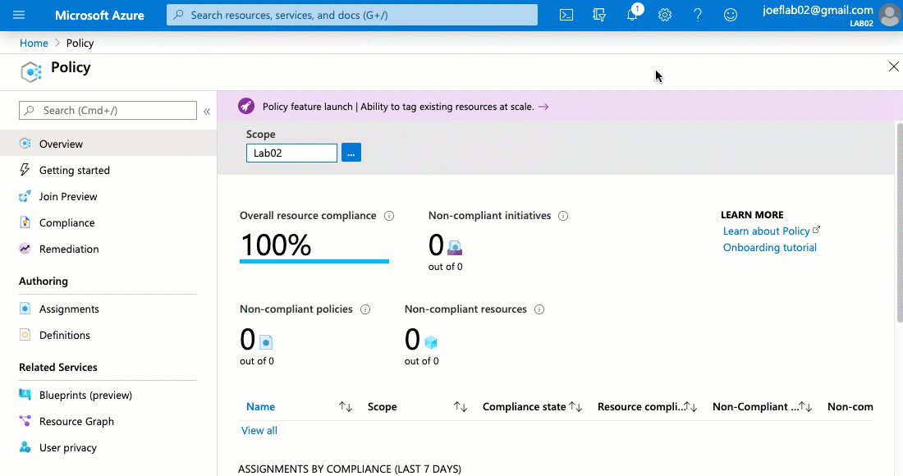
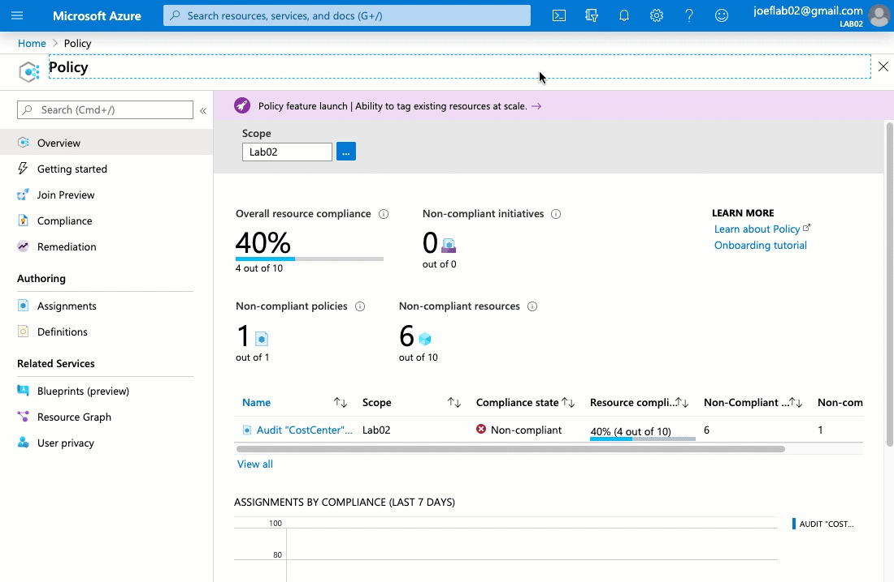

# Introduction to Azure Policy 

### Goals 
This article will help give you an overview of Azure Policy and how it can be utilized to help govern your Azure Environment.  It will be the first of a multi-part blog series covering some examples of how to leverage Azure Policy.   

Today we will cover the components of Azure Policy.  We will then set up a policy that will allow us audit resources to ensure they have a specific tag defined. 

### What is Azure Policy?
Azure Policy is a free service within Azure that helps us govern our Azure resources.  It allows us to create one or more definitions that we can use to control how our resources should be configured.  Additionally, we have options to report on or modify existing resources.  

Azure Policy helps give us the ability to ensure that our Azure resources follow our corporate policies.  Below are some examples of how Azure Policy can be utilized:

- Ensuring that only certain resource types can be deployed (Including specific resource sizes)
- Ensure that your resources have the appropriate diagnostic settings configured
- Only allow resources to be deployed to allowed Azure regions (Think GDPR)
- Ensure resources have the required tagging to assist with any financial or management tasks 

### Prerequisites
You will need a valid Azure subscription and have the Contributor RBAC role assigned to your account

### Step 1 - How to access Azure Policy
We can access Azure Policy from multiple locations within the Azure Portal.   The most direct way is to search for Azure Policy in the search bar


### Step 2 - Azure Policy Components
Azure policy has a few key components that we need to understand before we can start to take advantage of its features. 

#### Definitions
Azure Policy Definitions are where we configure the specific rules of policy.  We specify the following in the definition
   - The conditions are we reviewing.  This can include:
      - The type of resources to apply against
      - The location of the resource
      - Specific settings of the resource (including its size)
    - The action we will take against resources that are not in compliance with the defined condition:
      - Audit - Report 
      - Deny - Prevent a resource from being created (or an existing resource from being modified)
      - Remediate - Fix the setting, append a tag, deploy if not present, etc... 

Below is an example of a policy definition.  

```json
{
  "mode": "Indexed",
  "policyRule": {
    "if": {
        "allOf":[
            {
              "field": "type",
              "equals": "Microsoft.Sql/servers/"
            },
            {
              "field": "[concat('tags[', parameters('tagName'), ']')]",
              "exists": "false"
            }
        ]
    },
    "then": {
      "effect": "deny"
    }
  },
  "parameters": {
    "tagName": {
      "type": "String",
      "metadata": {
        "displayName": "Tag Name",
        "description": "Name of the tag, such as 'environment'"
      }
    }
  }
}
```

As we can see the policy definitions are formatted using JSON.  If we look under the "PolicyRule" block we can see there is an "if/then" statement.  

The "if" block is defining the conditions that we are looking to confirm.  The "then" block controls what action the definition will take if the conditions in the "if" block is not met. 

Looking at the "If" block in the example above we can see there are two conditions that the definition is looking for.  Since the conditions are in an "allOf" block then both of the conditions must be met for the policy effect to apply. 

The first condition is validating the resource types.  The resource type must be a SQL Server for the condition to be true.  

```json
{
 "field": "type",
 "equals": "Microsoft.Sql/servers/"
},
```
 The second condition is looking at all tags associated with the resource.  You can see it is using the concatenate function to review the names of all the tags.  
 
In this example, we only want resources that do NOT have the specified tag to be affected.  This is why the "exists" value is set to "false".   Meaning that if the tag is present on the resource then we do not meet all the conditions of the "if" block so the resource will not be affected by the policy.   However, if it is missing the tag then the policy will be applied.   

```json
{
 "field": "[concat('tags[', parameters('tagName'), ']')]",
 "exists": "false"
}
```
Moving to the "then" block we can see it is currently set to "deny".  This means that if a SQL Server is being created and does NOT have the specific tag associated, Azure Policy will not allow you to create it.

```json
},
 "then": {
 "effect": "deny"
}
```

We can also see the parameter block in the bottom section.  We create the parameters in the definition but we do not assign any values to those parameters yet.

#### Assignments
Once we have defined what we want our Azure Policy to do, we need to create an assignment to tell Azure what resources we want to apply the policy too.  We can apply a Policy to a management group, a subscription or a specific resource group.  

When assigning a policy you have to provide the following information
- What definition we will be applying
- Where are we applying this definition 
- Provide values for any parameters in the definition.


### Step 3 - Creating our Policy Definition
Now that we understand the core components of an Azure Policy, let's create one for ourselves.  The goal of this policy will be to audit our resources to ensure they have the "CostCenter" tag.  This tag is an example of a way to charge the various business units for their resources in Azure. 

We need to start by getting our definition created.  We are going to use a built-in definition as our starting point.  From Azure Policy lets go to "Definitions" on the left.  

Filter the category so we only see the "Tags" category.  

Locate and select the definition "Require specified Tag" 

Create a duplicate of the definition so we can edit it.  


We are going to associate it with the current subscription and give it the name "Audit Specified Tag".  We will type in a brief description explaining the purpose of the definition.   You will want to use general terms for your definition name and description as it could be used multiple times.

Dropping down to the policy rule we will be making a change to the policy effect.  We can see the original definition had an effect of "deny".  This would have prevented a resource from being created if it didn't have the proper tag assigned.

```json
},
 "then": {
 "effect": "deny"
}
```

We want to update this so that it will still allow the resource to be created without the tag defined.   However, we still want it to audit the resource since it is not in compliance.  To do this we update the effect to "audit". 

```json
},
 "then": {
 "effect": "audit"
}
```
*You may notice that there is not a resource type specified in the "if" block as our example above did.  This is because we want to this to apply to all resources in the environment.*d

Now that we have everything set we can save the policy definition. 


### Step 4 - Assigning the Policy Definition 
With our definition created we can now to assign it.  We will be assigning this at the subscription level so it will run against all resources within that subscription.  

From the Azure Policy page, we click on "Assignments" on the left side. 

We then click on Assign Policy on the top.  

We can now define the specifics of the assignment.  We are going to apply this to the subscription which is selected by default. 

You may notice the exclusions option as well.  We would use this if we did not want the policy definition to run against one or more child item of the assignment.  In our example, we want it to run against everything so we will not configure an exclusion. 

We select the policy definition from the list of available definitions. 

You see it will set the assignment name to the definition name by default.  We will provide a detailed name for the assignment since it is specific to this instance.  In our example, I will use 'Audit "CostCenter" Tag'.  Enter a brief description and click on "Next"

Select "Next"

We will not have any remediation tasks defined in this assignment (we will cover this in another blog post)

Select "Next"

Review the settings and then click on "Create"



We have successfully created our fist Azure Policy!! (Champagne optional)

### Step 5 - Reviewing Policies
Now that we have created our policy we need to ensure that is working as intended.  From the Azure Policy page select "Compliance" on the left. 

We can now see our policy listed.  If we select the policy we can now review the various resources that CostCenter tag defined, as well as those that do not. 



Please note that it can take up to 30 minutes for the results to present once a policy has been created. 

I hope you enjoyed this post. Please check back as we will continue to provide ways to leverage Azure Policy!!
