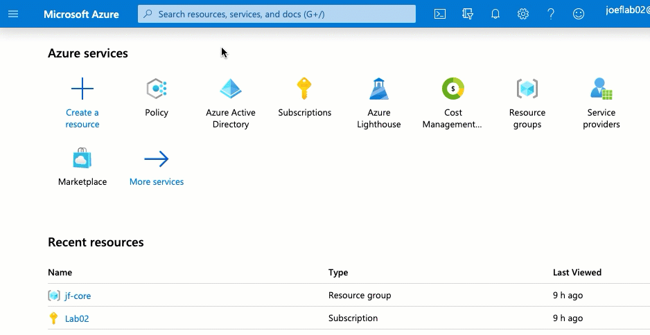
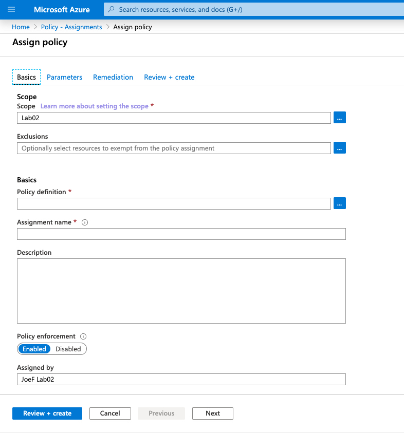
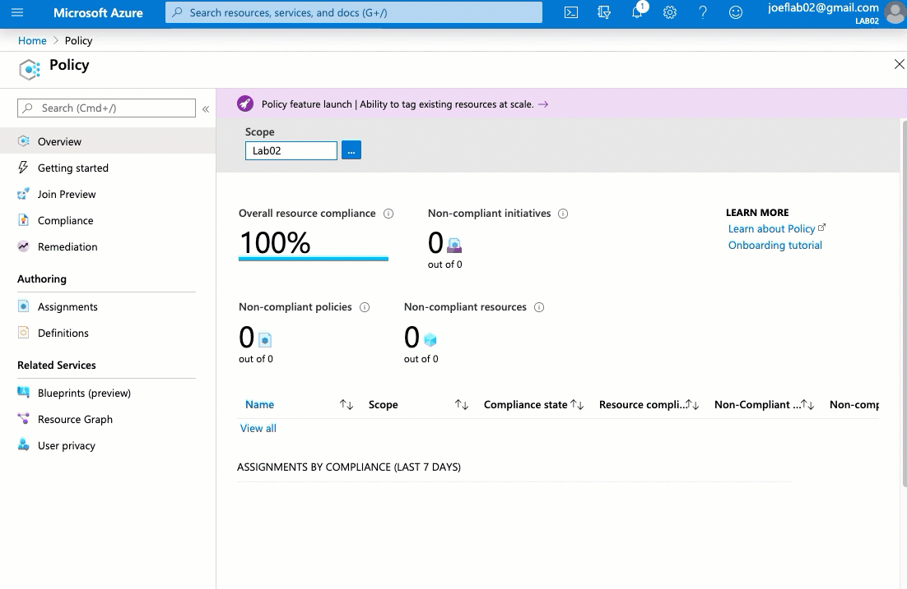
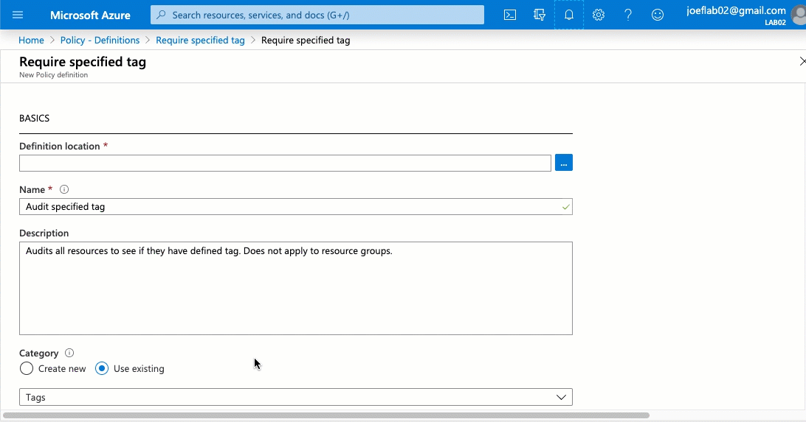

# ITEMS TO VALIDATE
- Permissions required to create and apply policies
- What is the search bar in Azure Portal called

# Introduction to Azure Policy 

### Goals 
This article will help give you an overview of Azure Policy and how it can be leveraged to help govern your Azure Environment.  It will be the first of a multi-part blog series that will cover some more in-depth examples of how Azure Policy can be leveraged.    

Today we will cover the components of Azure Policy.  We will then set up a policy that will allow us audit resources to ensure they have a specific tag defined. 

### What is Azure Policy?
Azure Policy is a free service within Azure that helps us govern our Azure resources.  It allows us to create one or more definitions that we can use to control how our resources should be configured.  Additionally, we have options to report on or modify existing resources.  

Azure Policy helps give us the ability to ensure that our Azure resources comply with our corporate policies.  Below are some examples of how Azure Policy can be utilized
- Ensuring that only certain resource types can be deployed (Including specific resource sizes)
- Ensure that your resources have the appropriate diagnostic settings configured
- Only allow resources to be deployed to allowed Azure regions (Think GDPR)

### Prerequisites
You will need a valid Azure subscription and will need ## VALIDATE PERMISSIONS FOR POLICIES

### Step 1 - How to access Azure Policy
We can access Azure Policy from multiple locations within the Azure Portal.   The most direct way is to search for Azure Policy in the search bar



### Step 2 - Azure Policy Components
Azure policy has a few key components that we need to understand before we can start to take advantage of its features. 

#### Definitions
Azure Policy Definitions are where we configure the specific rules of policy.  We define the following in the definition
    - The type of resources to apply against
    - The conditions are we reviewing
    - The action we will take against resources that are not in compliance 

Below is an example of a policy definition. 

```json
{
  "mode": "Indexed",
  "policyRule": {
    "if": {
        "allOf":[
            {
              "field": "type",
              "equals": "Microsoft.Sql/servers/"
            },
            {
              "field": "[concat('tags[', parameters('tagName'), ']')]",
              "exists": "false"
            }
        ]
    },
    "then": {
      "effect": "deny"
    }
  },
  "parameters": {
    "tagName": {
      "type": "String",
      "metadata": {
        "displayName": "Tag Name",
        "description": "Name of the tag, such as 'environment'"
      }
    }
  }
}
```

As we can see the policy definitions are formatted using JSON.  If we look under the "PolicyRule" block we can see there is an "if/then" statement.  The "if" block is defining the resources and conditions that we are looking to validate.  The "then" block controls what action the definition will take if the conditions in the "if" block are met. 

Looking at the "If" block in the example above we can see that there are 2 conditions that the definition is looking for.  Since the conditions are in a "allOF" block then  both of the conditions must be met in order for the policy effect to apply. 

The first condition is looking specifically at the resource types.  The resource type must be a SQL Server in order for the condition to be true.  

```json
{
  "field": "type",
  "equals": "Microsoft.Sql/servers/"
},
```
 The second condition is looking at all tags associated with the resource.  You can see it is using the concatenate template function to review the names of all of the tags.  
 
Since we are looking to see if a tag is not defined in this example we need this condition to return a value of true if it the tag is not present.  This is why the "exists" value is set to "false".   

```json
{
  "field": "[concat('tags[', parameters('tagName'), ']')]",
  "exists": "false"
}
```
Dropping down to the "Then" block we can see it is currently set to "deny".  This means that if a resource group is being created and does NOT have the defined tag associated with the resource group, Azure Policy will not allow you to create it.

```json
},
"then": {
  "effect": "deny"
}
```

We can also see the parameter block in the bottom section.  We create the parameters in the definition but we do not assign any values to those parameters yet.

#### Assignments
Once we have defined what we want our Azure Policy to do, we need to create an assignment so we can control which resources we want it to apply against.  We can apply a Policy to a management group, a subscription or a specific resource group.  

When assigning a policy you have to provide the following information
- What definition we will be applying
- Where are we applying this definition 
- Provide values for any parameters that are defined in the definition.



### Step 3 - Creating our Policy Definition
Now that we understand the components of an Azure Policy lets create one for ourselves.  The goal of this policy will be to audit our resources to ensure they have the "CostCenter" tag.  

To start let's get our definition created.  We are going to use a built-in definition as out starting point.  From Azure Policy lets go to "Definitions" on the left.  

Filter the Category so we only see the "Tags" category.  

Locate and select the definition "Require specified Tag" 

Create a duplicate of the definition so we can edit it.  



We are going to associate it with the current subscription and give it the name "Audit CostCenter Tag".  We will type in a brief description explaining the purpose of the definition. 

Dropping down to the policy rule we will be making a change to the policy effect.  We can see the source definition that we copied was set to deny a resource from being created if the specified tag was not present. 

```json
    },
    "then": {
      "effect": "deny"
    }
```

We want to update this so that it will still allow the resource to be created without the tag defined.   We do want it to audit the variance.  To do this we update the code to the following

```json
    },
    "then": {
      "effect": "audit"
    }
```

Now that we have everything set we can save the policy definition




### Step 4 - Assigning the Policy Definition 
Now that we have created our definition we need to assign it.  We will be assigning this at the subscription level so it will run against all resources within that subscription.  

From the Azure Policy page, we click on "Assignments" on the left side

Select Assign Policy

It has the scope of the policy set to the subscription by default.  We won't be changing this.  You may notice the exclusions option as well.  We would use this if we did not want the policy definition to run against one or more resources or resource groups.  We want it to run against everything so we will not configure an exclusion. 

We select the policy definition from the list of available definitions. 

You see it will automatically set the definition name to the assignment name.  You can leave this or change it depending on your preferences or if you will be using this definition more than once.  Enter a brief description and click on "Next"

!!! INSERT VIDEO OF FILLING OUT THE BASICS TAB

On the Parameters tab, we can now provide values for each of the parameters that are defined in the definition.  We are looking specifically for the "CostCenter" tag so we will enter that here. 

Select "Next"

We will not have any remediation tasks defined in this assignment (we will cover this in another blog post)

Select "Next"

Review the settings and then click on "Create"

!!! INSERT VIDEO OF THE PARAMETERS --> REVIEW + CREATE TAB

We have successfully created our fist Azure Policy!! (Champagne optional)

### Step 5 - Reviewing Policies
Now that we have created our policy we need to ensure that is working as intended.  From the Azure Policy page select "Compliance" on the left. 

We can now see our policy listed.  If we select the policy we can now review the various resources that CostCenter tag specified as well as those that do not. 

Please note that it can take up to 30 minutes for the results to present once a policy has been created. 

I hope you enjoyed this post and please check back for the next post which will cover leveraging Azure Policy to configure the types of resources that can be deployed to your environment

