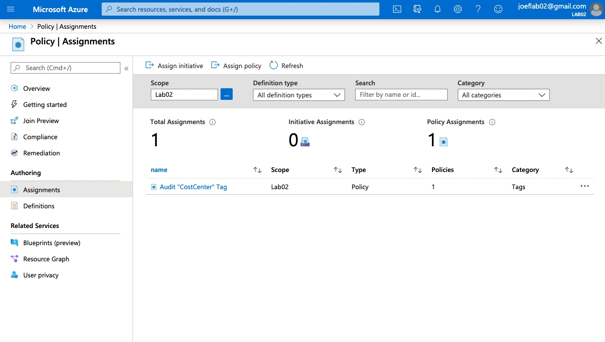
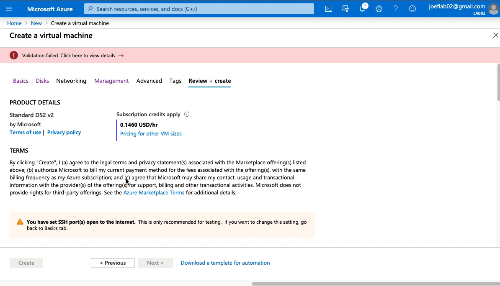
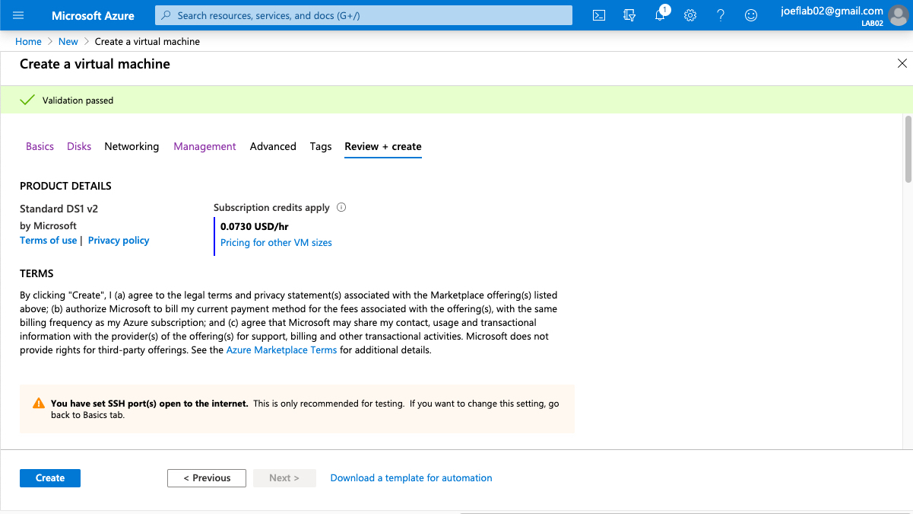
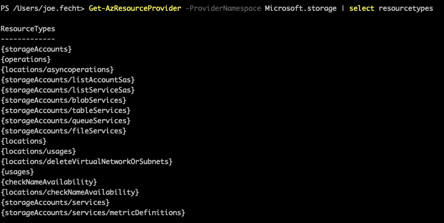
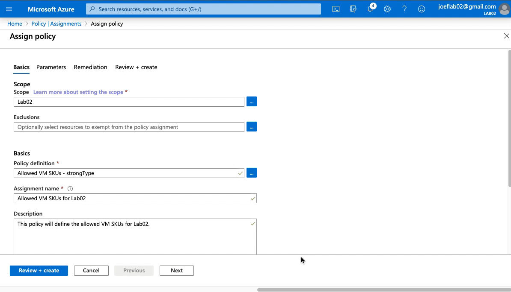

# Managing resources with Azure Policy

### Goals
This is the second post in a series to help you become more familiar with Azure Policy.  If you haven't seen the [first post](https://cloudskills.io/blog/azure-policy) please take a look to help familiarize yourself with the components of Azure Policy.  

We will build upon that by learning more about the effects within Azure Policy.  We will also discuss how to create better parameters to simplify assigning our policy definitions.  


### Effects in Azure Policy
effects within Azure Policy is where you decide how Azure Policy will handle resources that meet the "if" condition of the policy definition.  There are 7 effects as of this writing that are available.  2 more are available in preview that are associated with specifically with Kubernetes that we will cover at a later time.  

- Append
    - This allows you to append additional fields to a resource when it is created or updated.  
    - For example, you need to ensure a certain IP range is always allowed to a storage account or a SQL server.
- Audit
    - This helps you identify a non-compliant resource.  It does not stop a resource from being created or modified, merely noting if it is in compliance or not.  This is what we configured in the [first post](https://cloudskills.io/blog/azure-policy) post.  
- AuditIfNotExists
    - This helps you identify if a resource does not have the required properties defined as intended. 
    - For example, you need to ensure that a VM has the diagnostic an extension enabled
- Deny
    - This will prevent a resource from being created or updated.  We will be covering this later in this post.
- DeployIfNotExists
    - This will allow you to modify a resource if it is not configured as intended.  Similar to AuditIfNotExists, except this allows you to apply a template to the resource to remediate the variance. 
- Disabled
    - This is leveraged for testing a policy.  For example, if you want to create a policy to ensure the "if" statement is running properly but do not want the rest of the policy to apply. 
- Modify
    - This is used to manage the tags associated with a resource.  

We will provide examples for both the "Deny" and "Modify" effects in this post.  Before we dive into how to use the effects lets discuss parameters.

### How to make better parameters in Azure Policy
Ultimately our goal with any Azure Policy is to help us manage our environment with the minimal amount of manual work.  One way to help us do this is by using parameters in our policy definitions so that it can be adjusted for each assignment rather then having to create a new definition each time.   

The parameters in Azure Policy follow the same format as those for ARM templates.  You can create descriptions, allowed values, and even specify a default value for your parameters. This example below shows one that has all of these defined.  This example only allows you to select a storage SKU that is geographically replicated.  This would be a requirement if you need to support a workload that must be available if there was regional outage.  

```json
"parameters": {
  "allowedStorageSKU": {
    "type": "string",
    "allowedValues": [
      "Standard_GRS",
      "Standard_RAGRS",
    ],
    "defaultValue": "Standard_GRS",
    "metadata": {
      "description": "Select the type of replication to use for the storage account."
    }
  }
}
```

### Step 1 - Creating a Deny Policy

Now lets take what we learned about effects and parameters and put it into action.  We are going to setup a policy that will only allow three VM SKUs to be allowed.  To do this we will use a "Deny" effect and provide a list of allowed VM SKUs that can be selected.  If a user attempts to provision a VM that is not listed then the policy will prevent the VM from being provisioned.  

To start we need to create our policy definition.  I've created a [sample policy](https://github.com/jf781/Azure.Policy.Demos/blob/master/Deny-Policy-Example-1.json) for you if you'd like to download and follow along.

Looking at the policy rule we can see that the policy is looking at VMs and specifically the VM SKU.  If the VM SKU is not in parameter "listOfAllowedSKUs" then policy will enforce the effect which is set to Deny.  

```json
"policyRule": {
  "if": {
    "allOf": [
      {
        "field": "type",
        "equals": "Microsoft.Compute/virtualMachines"
      },
      {
        "not": {
          "field": "Microsoft.Compute/virtualMachines/sku.name",
          "in": "[parameters('listOfAllowedSKUs')]"
        }
      }
    ]
  },
  "then": {
    "effect": "deny"
  }
}
```
Focusing now on the "listOfAllowedSKUs" parameter, you can see that the we have supplied three VM SKUs in the allowedValues key.  

```json
  "parameters": {
    "listOfAllowedSKUs": {
      "type": "Array",
      "allowedValues": [
          "Standard_DS1_v2",
          "Standard_DS3_v2",
          "Standard_DS5_v2"
      ],
      "metadata": {
        "displayName": "Allowed SKUs",
        "description": "The list of SKUs that can be specified for virtual machines."
      }
    }
  }
```

Now lets put in this in place.  I've already created the policy definition and will create a new assignment for this example.  



When we created this policy definition we could select from the drop down menu which of the allowed VM SKUs we wanted to apply.  By creating the list of SKUs in the policy definition it gives us the flexibility to fine tune this further when we create the policy assignment.  

Now that we have this in policy definition assigned lets see what happens when we try to create a VM outside of that SKU.  



We attempted to create a VM  with a SKU of "Standard DS2 v2" and we were not allowed to create the VM because it failed validation.  Diving further into that we can see that it was prohibited because the the it violated the "Allowed VM SKUs for Lab02" policy assignment we created earlier.

To confirm our policy will work when we select one of the VM SKUs defined lets change the VM size to "Standard DS1 v2" and try again.   



Perfect!  Our policy is doing exactly what we intended.  But we aren't done yet, we can make this even better. 

### Step 2 - Leveraging strongType for Parameters

This is a perfect example of a policy that will do exactly what we want today.  But what happens when we want to allow a new VM SKU?  We would have manually update the existing definition to include the new SKU which seems simple enough.  However, we can't alter a policy definition if it is currently assigned.  We have to delete the any assignment, update the definition, and then re-create the assignment again.  There has to be an easier way...  

Enter the parameter property "strongType".  When this property is defined as part of a parameter, it provides a mutli-select list of available options to select from when creating the policy assignment.  We no longer have to manually specify the SKUs or other allowed values.  

Lets look at how we would setup the policy definition.  We got rid of the allowedValues and we added StrongType to the metadata property.   

```json
"parameters": {
  "listOfAllowedSKUs": {
    "type": "Array",
    "metadata": {
      "displayName": "Allowed SKUs",
      "description": "The list of SKUs that can be specified for virtual machines.",
      "strongType": "vmSKUs"
    }
  }
}
```

In this example we are focused providing a list of VM SKUs.  The strongType property can be used to select existing resources, locations, storage types and SKUs, etc...  For example if we wanted to have a policy definition that gave us the existing Log Analytics Workspaces you could set strongType to:

```json
{
"strongType": "Microsoft.OperationalInsights/workspaces"
}
```

Or if we wanted to provide a list of existing storage accounts:

```json
{
"strongType": "Microsoft.Storage/storageAccounts"
}
```

We can see all of the options for the strongType property by running the [Get-AzResourceProvider](https://docs.microsoft.com/en-us/powershell/module/az.resources/get-azresourceprovider?view=azps-3.6.1) PowerShell command. Under each of the providers we can see the ResourceTypes property.  This is where we determine the specific property we would set as the stongType.  We can see in the screen shot below how the ResourceTypes under the Storage provider.   



There are also options for the stongType property that are not related to Resource Providers.  These can be useful as we will see in our example.

- location
- resourceTypes
- storageSkus
- vmSKUs
- existingResourceGroups

We have deleted the policy assignment we created early.  There is a new policy definition that is using strongType instead of allowedValues as shown in the code above.  We have started the policy assignment process and are ready to assign the updated policy definition.  (Note - You do not need to include "strongType" in the policy name.  That was just for demonstration purposes.) 



As you can see our end result is exactly the same as before.  However, we are not able to make changes to allow other VM SKUs in the future on the fly without having to alter the policy definition or recreate any other assignments that may use that same definition. 

The strongType is an incredibly powerful tool to use when designing our Azure Policies.  It helps us simplify the process of writing our policy definitions and makes them flexible as both our environment and Azure itself evolves. 
Of equal importance, it also the person creating the policy assignments by removing some of the guess work when defining the parameters and also reduces the potential for human error.  

