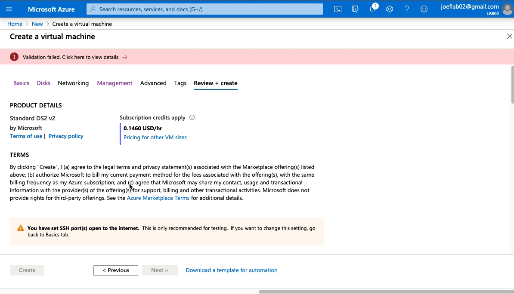
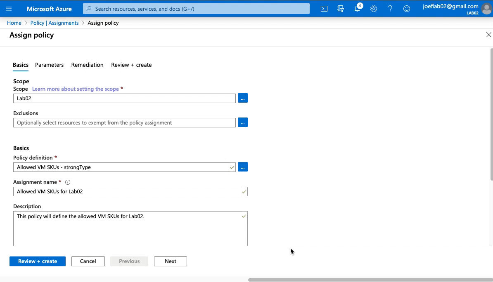
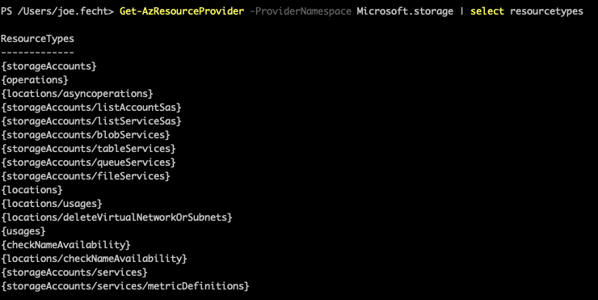

# Azure Policy Effects and Parameters

### Goals
This is the second post in a series to help you become more familiar with Azure Policy.  If you haven't seen the first post, [Getting Started with Azure Policy](https://cloudskills.io/blog/azure-policy), please take a look as it will help you familiarize yourself with the components of Azure Policy.  

We are going to build upon that by learning more about how effects work within Azure Policy.  We are also going discuss how to make better parameters in our policy definitions to simplify our assignments.  


### Effects in Azure Policy
Each Azure Policy definition has an effect defined that let's Azure know how to handle the resources that meet the "if" condition.  At the time of this writing, there are 7 effects that are available.  There are two more effects specifically for Kubernetes that are in preview, however, we will cover them at a later time.  

- Append
 - This allows you to append additional fields to a resource when its created or updated.  
 - For example, you need to ensure a certain IP range is always allowed to a storage account or a SQL server.
- Audit
 - This helps you identify non-compliant resources.  It does not stop a resource from being created or modified, merely noting if it is in compliance or not.  This is what we configured in the [previous post](https://cloudskills.io/blog/azure-policy).  
- AuditIfNotExists
 - Similar to audit, this helps you identify if a resource does not have the required properties defined as intended. 
 - For example, you need to ensure that a VM has the diagnostic extension enabled.
- Deny
 - This will prevent a new resource from being created or an existing resource from being modified.  We will be covering this later in this post.
- DeployIfNotExists
 - This will allow you to modify a resource if it is not configured as intended.  Similar to AuditIfNotExists, except this allows you to apply a template to the resource to remediate the variance. 
- Disabled
 - This is for testing a policy.  For example, if you want to create a policy to ensure the "if" statement is working as intended but do not want the rest of the policy to apply. 
- Modify
 - This is used to manage the tags associated with a resource.  

One thing we also need to understand is the order that Azure Policy effects are evaluated.  As a resource is being created or evaluated, Azure Policy will determine which policy assignments to apply against that resource.  It then evaluates which ones should be applied first.  The order in which policies are applied is:  

1. Disabled
2. Append and Modify
3. Deny
4. Audit
5. AuditIfNotExists and DeployIfNotExists

The order in which policies effects apply is important because a resource may be changed by one policy and another would trigger a deny or audit effect.  For example, if we have a policy with the Modify effect which defines a CostCenter tag to all resources in a resource group.  We also have another policy that has a Deny effect for any resource without a CostCenter tag applied to the subscription.  

If the order that the policies applied wasn't controlled and the Deny policy applied first, any resource without the CostCenter tag manually defined in that resource group would be prohibited.  Because we have the policies applied in a defined order, the Modify policy will run first, creating the CostCenter tag, and then we don't have to worry about the Deny policy applying. 


### How to make better parameters in Azure Policy
Ultimately our goal with any Azure Policy is to help us manage our environment with a minimal amount of manual intervention.  One way to achieve this is by utilizing parameters properties in our policy definitions.  By leveraging parameters properties, our policy assignments can be adjusted for each assignment rather than having to create a new definition each time.   

The parameters in Azure Policy follow the same format as those for ARM templates.  You can create descriptions, allowed values, and even specify a default value for your parameters. The example below has all of these parameter properties defined.  

This parameter only allows you to select a storage SKU that is geographically replicated per the allowedValues property.  This would be a requirement if you need to support a workload that must be available in the event of a regional outage.  

```json
"parameters": {
  "allowedStorageSKU": {
    "type": "string",
    "allowedValues": [
      "Standard_GRS",
      "Standard_RAGRS"
    ],
    "defaultValue": "Standard_GRS",
    "metadata": {
      "description": "Select the type of replication type to use for the storage account."
    }
  }
}
```

### Step 1 - Creating a Deny Policy

Now let's take what we learned about effects and parameters and put it into action.  Our goal is to set up a policy that will only allow specific VM SKUs to be selected.  To do this we will use a "Deny" effect and then provide a list of allowed VM SKUs that can be selected.  If a user attempts to provision a VM that is not listed in the parameters then the policy will prevent the VM from being provisioned.  

To start we need to create our policy definition.  I've created a [sample policy](https://github.com/jf781/Azure.Policy.Demos/blob/master/Deny-Policy-Example-1.json) for you if you'd like to download and follow along.

Looking at the policy rule in the definition, we can see that the policy is looking at the resource type "Microsoft.Computer/virtualMachines" or VM.  If the resource is a VM the policy rule will also look at the SKU for that VM.  If the VM SKU is not listed in the parameter "listOfAllowedSKUs", then the policy will enforce the Deny effect.  

```json
"policyRule": {
  "if": {
    "allOf": [
      {
        "field": "type",
        "equals": "Microsoft.Compute/virtualMachines"
      },
      {
      "not": {
        "field": "Microsoft.Compute/virtualMachines/sku.name",
          "in": "[parameters('listOfAllowedSKUs')]"
        }
      }
    ]
  },
  "then": {
    "effect": "deny"
  }
}
```
Focusing now on the "listOfAllowedSKUs" parameter, you can see that we have supplied three VM SKUs in the allowedValues property.  

```json
 "parameters": {
    "listOfAllowedSKUs": {
    "type": "Array",
    "allowedValues": [
      "Standard_DS1_v2",
      "Standard_DS3_v2",
      "Standard_DS5_v2"
    ],
    "metadata": {
      "displayName": "Allowed SKUs",
      "description": "The list of SKUs that can be specified for virtual machines."
    }
  }
}
```

Now lets put in this in place.  I've already created the policy definition and will create a new assignment for this example.  


When we created our policy assignment, we can select which of the SKUs defined in the listOfAllowedSKUs" parameter wanted for this specific assignment (in this example we selected all 3).  By creating the list of SKUs in the policy definition it gives us the flexibility to fine-tune this further when we create the policy assignment.  Additionally, it helps reduces the chance that someone will "fat finger" a value by manually typing it in.


### Step 2 - Testing the Policy Assignment
Now that we have this in policy definition assigned, let's see what happens when we try to create a VM using a SKU that is not listed in the assignment.  



We attempted to create a VM  with a SKU of "Standard DS2 v2" and were unsuccessful because it failed validation.  Diving further into why it failed, we can see that it violated the "Allowed VM SKUs for Lab02" policy assignment we created earlier.

To confirm our policy is working as intended, let's change the VM size to "Standard DS1 v2" and try again.   


Perfect!  Our policy is working as designed.  But we aren't done yet, we can make this even better. 

### Step 3 - Leveraging strongType for Parameters

This is a perfect example of a policy that will do exactly what we want today.  But what happens when we want to allow a new VM SKU?  We would have manually update the existing definition to include the new SKU which seems simple enough.  However, we can't alter a policy definition if it is currently assigned.  We would have to:

1. Delete any assignment using that definition
2. Update the definition with the new SKU
3. Re-create one or more assignments again.  

There has to be an easier way...  

Enter the parameter property "strongType".  When this property is defined as part of a parameter, it provides a multi-select list of available options when creating the policy assignment.  We no longer have to manually specify the SKUs or other allowed values.  

First, let's look at how we would set up the policy definition.  We got rid of the allowedValues and we added StrongType to the metadata property and specified 'vmSKUs'.  

```json
"parameters": {
  "listOfAllowedSKUs": {
    "type": "Array",
    "metadata": {
      "displayName": "Allowed SKUs",
      "description": "The list of SKUs that can be specified for virtual machines.",
      "strongType": "vmSKUs"
    }
  }
}
```

Let's take a look at how this works.  The policy assignment we created early has been deleted.  There is a [new policy definition](https://github.com/jf781/Azure.Policy.Demos/blob/master/Deny-Policy-Example-2.json) that is using strongType instead of allowedValues as shown in the code above.  We have started the policy assignment process and are ready to assign the updated policy definition.  (Note - You do not need to include "strongType" in the policy name.  That was for demonstration purposes.) 



As you can see our end result is exactly the same as before.  We are now able to make changes to allow other VM SKUs in the future without having to alter the policy definition or recreate any other assignments. 

In the example above, we are focused on providing a list of VM SKUs.  The strongType property can also be used to select existing resources, locations, storage types and SKUs, etc...  For example, if we wanted to have a policy definition that gave us the existing Log Analytics Workspaces you could set strongType to:

```json
{
"strongType": "Microsoft.OperationalInsights/workspaces"
}
```

Or if we wanted to provide a list of existing storage accounts:

```json
{
"strongType": "Microsoft.Storage/storageAccounts"
}
```

We can see the available options for the strongType property by running the [Get-AzResourceProvider](https://docs.microsoft.com/en-us/powershell/module/az.resources/get-azresourceprovider?view=azps-3.6.1) PowerShell command. Under each of the providers, we can see the ResourceTypes property.  This is where we determine the specific property we would set as the strongType.  

We can see in the screenshot below how the ResourceTypes under the Storage provider.   



There are also options for the strongType property that are not related to Resource Providers, for example vmSKUs.  These can be useful as we saw in our example above.

- location
- resourceTypes
- storageSkus
- vmSKUs
- existingResourceGroups

The strongType is an incredibly powerful tool to use when designing our Azure Policies.  It helps us simplify the process of writing our policy definitions.  More importantly,  it makes them flexible as both our environment and Azure itself evolves. It also helps the person making the policy assignments by providing a list of options rather than manually entering the resource name or type.  

Hopefully, this has helped you understand how to effects work in Azure Policy and how to create more effective parameters.  Check back soon as we explore how to make updates to our resources using Azure Policy.  