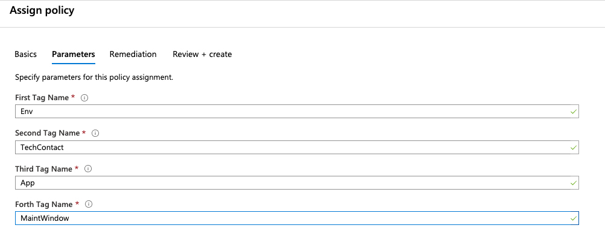

# Talking points
1. What it's so important
2. Enforcing tagging
3. Filtering based on tags simple
4. Filtering based on tags advanced

# Leveraging Azure Policy to Manage Tagging

### Goals

Our goal today is to talk about how you can create and manage tags within Azure Policy.  Tags in Azure can be extremely powerful for a number of reasons.  These can include managing charge backs for various resources, defining what environment a resource is associated with, and who is the owner for the resource, among many other.  Once we have walked through this post you should be able to create a strategy for defining and managing those tags.

 It is going to build upon our previous posts on [Getting Started with Azure Policy](https://cloudskills.io/blog/azure-policy) and [Managing Resources with Azure Policy](https://cloudskills.io/blog/azure-policy). 

### Understanding Azure Tags

Before we learn how Azure Policy can manage tags lets take a few moments to understand tags within Azure.  Tags can be associated with a resource,  resource group, or a subscription.  A tag consist of a key value pair, called tag name and tag value.  For example "Environment=Production" or "Owner=Accounting".  

One thing to keep in mind is that tag name is case-insensitive, meaning that "Environment=Production" and "environment=Production" are going to be viewed as the same.  However, the tag value is case-sensitive.  So "Environment=Production" and "Environment=production" are going to be viewed as two different items.  

When you assign a tag to a subscription or resource group it does not automatically inherit down to the resources in that group or subscription.  While I was initially frustrated by this it does make sense.  While it is ideal to keep you resources grouped together in the same resource group or subscription, in practice it doesn't always happen.  By using tagging, it gives us the added granularity to be able apply metadata to a resource that is independent of it's resource group or subscription.  Networking, monitoring, or other "core" services are great examples of this as they are ingrained within Azure.

### Determining your tagging strategy

As with most things, understanding tags by themselves is a great, but they don't deliver any real value without a plan.  Ideally before we begin to deploy tags, we need to have a strategy on what were trying to accomplish.  Some example questions of those goals may include: 

- What environment does each resource belongs to? 
- What is the name of the application that is supported by the resource? 
- Who is the technical contact for each resource?
- Does this resource have a maintenance window? 
- Who should be charged for the cost associated with this resource? 
- Are there any regulatory obligations for this resource (PCI, ISO 27001, etc. )

These are just some sample questions.  We will need to sit down with the stake holders to determine what information they will need and incorporate that with the information that we would like to have maintained.  

Microsoft recently updated Azure so you can assign up to 50 tags to most resources (it was previously limited to 15 tags). So while this is not as much of a constraint as it was before you do need to keep this in mind as you are defining your tagging strategy.  Microsoft has a list of [supported resources](https://docs.microsoft.com/en-us/azure/azure-resource-manager/management/tag-support) that can be tagged.  

Once we have a list of requirements, we can determine our tagging strategy for our environment.  For our example we are going to focus the first 4 questions. 

### How to integrate Azure Policy with your tagging strategy

Now that we understand what information we need to be associated with each resource, we need to determine what tags we are going to create to associate this information.  We are going to create the following tags to accomplish this. 

- "Env" - This will tell us which environment the resource belongs to
- "TechContact" - This will tell us which group to reach out to for questions
- "App" - This will tell us the application that the resource is supporting
- "MaintWindow" - This will tell us if the resource has a defined maintenance window

While it would be great to have a 100% clean slate with no resources in Azure to work from now that we have our tagging strategy defined, this unfortunately isn't always the case.  So to start we are going to create a policy that will audit all resources to see which ones have these tags defined and which ones do not.  

After we have successfully audited our existing resources we can create a policy that will prohibit the any new resources from being created that do not have the "Env", "TechContact", and "App" tags defined.  This is a great way to ensure that resources are correctly tagged and to help prevent any issues down the road.  

Finally, since not all resources will have a defined maintenance window (Logging, or backups), we are not going to define this as a required tag.  However, we do know that any resources that is in the production environment and is associated with the "Accounting" application will have a maintenance window on Sunday from 06:00 - 09:00 UTC.  We are going to use Azure Policy to automatically populate this field for us.  


### Step 1 - Create an auditing policy for Azure Tags

The first part of any good plan to is to figure out what we have in place today so we know where to go.  We are going to audit the existing resources to see how many resources are in place without those tags defined.  We are going to use the policy definition below to create our audit. 
You can find all of the example policy definitions [here](https://github.com/jf781/Azure.Policy.Demos). 

```json
{
  "mode": "Indexed",
  "policyRule": {
    "if": {
        "allOf": [
            {
                "field": "[concat('tags[', parameters('tagName1'), ']')]",
                "exists": "false"
            },
            {
                "field": "[concat('tags[', parameters('tagName2'), ']')]",
                "exists": "false"
            },
            {
                "field": "[concat('tags[', parameters('tagName3'), ']')]",
                "exists": "false"
            },
            {
                "field": "[concat('tags[', parameters('tagName4'), ']')]",
                "exists": "false"
            }
        ]
    },
    "then": {
      "effect": "audit"
    }
  },
  "parameters": {
    "tagName1": {
      "type": "String",
      "metadata": {
        "displayName": "First Tag Name",
        "description": "Name of the tag, such as 'environment'"
      }
    },
    "tagName2": {
        "type": "String",
        "metadata": {
            "displayName": "Second Tag Name",
            "description": "Name of the tag, such as 'environment'"
        }
    },
    "tagName3": {
        "type": "String",
        "metadata": {
            "displayName": "Third Tag Name",
            "description": "Name of the tag, such as 'environment'"
        }
    },
    "tagName4": {
        "type": "String",
        "metadata": {
            "displayName": "Forth Tag Name",
            "description": "Name of the tag, such as 'environment'"
        }
    }
  }
}
```
If you need to see how to create and assign the policy definition please review the [first post](https://cloudskills.io/blog/azure-policy) in this series.  

We know have our policy definition created and are assigning it to our subscription.  You can see in the parameters that it is asking us to specify the tags that we are auditing for.  Remember, the tag names are case insensitive, we are using camel case to simply make it easier to read.  



After we let that policy process we can see we have a lot of work on our hands.  While it is not the result that we had hoped for it, it does provide guidance on our next steps.  It also gives us a good baseline to see how far we have come.  It also provides on-going 


### Step 2 - Create a policy to prohibit resources from being created without the Env, Owner, and App tags defined.  

