# Managing Resource Tagging with Azure Policy

### Goals

Our goal today is to talk about how you can create and manage tags within Azure Policy.  Tags in Azure can be extremely powerful for a number of reasons.  These can include managing chargebacks for resources, defining what environment a resource is associated with,  who is the owner, among many others.  Once we have walked through this post you should be able to create a strategy for defining and managing those tags.

This is going to build upon our previous posts on [Getting Started with Azure Policy](https://cloudskills.io/blog/azure-policy) and [Managing Resources with Azure Policy](https://cloudskills.io/blog/azure-policy). 

### Understanding Azure Tags

Before we learn how Azure Policy can manage tags lets take a few moments to understand tags within Azure.  Tags can be associated with a resource,  resource group, or a subscription.  A tag consist of a key-value pair called "tag name" and "tag value".  Two examples of tags are "Environment=Production" or "Owner=Accounting".  

One thing to keep in mind is that tag name is case-insensitive, meaning that "Environment=Production" and "environment=Production" are viewed as the same.  However, the tag value is case-sensitive.  So "Environment=Production" and "Environment=production" are viewed as two different items.  

When we assign a tag to a subscription or resource group it does not automatically inherit down to the child resources in that group or subscription.  While I was initially frustrated by this it does make sense.  Ideally, we would keep similar resources grouped together in the same resource group or subscription.  Unfortunately, in practice, it doesn't always happen.  By using tagging, we now have the granularity to be able to apply metadata to a resource that is independent of its resource group and subscription.  

Networking, monitoring, or other "core" services are great examples of this why this is useful.  They are often associated with multiple resources and applications.  If they were automatically assigned the tags from it's parent resource group or subscription it would be easy to assign the wrong tags. 

As we'll see later, there can still be use cases where inheriting tags the parent resource group can make sense. 

### Determining your tagging strategy

As with most things, understanding tags by themselves is great, but doesn't deliver any real value without a plan.  Ideally, before we begin to deploy tags, we will have a strategy on what we're trying to accomplish.  Some example questions that may help you define that strategy include: 

- What environment does each resource belongs to? 
- What is the name of the application that is supported by the resource? 
- Who is the technical contact for each resource?
- Does this resource have a maintenance window? 
- Who should be charged for the cost associated with this resource? 
- Are there any regulatory obligations for this resource (PCI, ISO 27001, etc. )

Part of this strategy includes sitting down with the stakeholders to determine what information they will need. We incorporate that with the information we need and create our list of tags.    

Microsoft recently updated Azure so you can assign up to 50 tags to most resources (it was previously limited to 15 tags).   While this offers more flexibility, you do need to keep this in mind as you are defining your tagging strategy.  Microsoft has a list of [supported resources](https://docs.microsoft.com/en-us/azure/azure-resource-manager/management/tag-support) that can be tagged.  

Once we have a list of requirements, we can determine our tagging strategy for our environment.  For our example we are going to focus the first 4 questions. 

### How to integrate Azure Policy with your tagging strategy

Now that we understand what information we need to have associated with each resource, we need to determine what tags we are going to create to associate this information.  For our example, we are going to create the following tags. 

- "Env" - This will tell us which environment the resource belongs to
- "TechContact" - This will tell us which group to reach out to for questions
- "App" - This will tell us the application that the resource is supporting
- "MaintWindow" - This will tell us if the resource has a defined maintenance window

While it would be great to have a 100% clean slate with no resources in Azure to work from, unfortunately, this isn't always the case. To start, we are going to create a policy that will audit our existing resources. We will use this to see which resources have these tags defined and which ones do not.  

After we have successfully audited our existing resources, we can create a policy that will prohibit the any new resources from being created that do not have the "Env", "TechContact", and "App" tags defined.  This is a great way to ensure that resources are correctly tagged and to help prevent more issues down the road.  

Since not all resources will have a defined maintenance window (Logging, or backups for example), we are not going to define this as a required tag.  However, in a future post we are going to show how we can dynamically assign a value to a tag based on the value of the other resource tags.  


### Step 1 - Create an auditing policy for Azure Tags

The first part of any good plan to is to figure out what we have in place today so we know where to go.  We are going to audit the existing resources to see how already many have the defined tags.  We are going to use the policy definition below to create our audit. 
You can find all of the example policy definitions [here](https://github.com/jf781/Azure.Policy.Demos). 

```json
{
  "mode": "Indexed",
  "policyRule": {
    "if": {
      "anyOf": [
        {
          "field": "[concat('tags[', parameters('tagName1'), ']')]",
          "exists": "false"
        },
        {
          "field": "[concat('tags[', parameters('tagName2'), ']')]",
          "exists": "false"
        },
        {
          "field": "[concat('tags[', parameters('tagName3'), ']')]",
          "exists": "false"
        },
        {
          "field": "[concat('tags[', parameters('tagName4'), ']')]",
          "exists": "false"
        }
      ]
    },
    "then": {
      "effect": "audit"
    }
  },
  "parameters": {
    "tagName1": {
      "type": "String",
      "metadata": {
        "displayName": "First Tag Name",
        "description": "Name of the tag, such as 'environment'"
      }
    },
    "tagName2": {
      "type": "String",
      "metadata": {
        "displayName": "Second Tag Name",
        "description": "Name of the tag, such as 'environment'"
      }
    },
    "tagName3": {
      "type": "String",
      "metadata": {
        "displayName": "Third Tag Name",
        "description": "Name of the tag, such as 'environment'"
      }
    },
    "tagName4": {
      "type": "String",
      "metadata": {
        "displayName": "Forth Tag Name",
        "description": "Name of the tag, such as 'environment'"
      }
    }
  }
}
```
If you need to see how to create and assign the policy definition please review the [first post](https://cloudskills.io/blog/azure-policy) in this series.  

We know have our policy definition created and are assigning it to our subscription.  You can see in the parameters that it is asking us to specify the tags that we are auditing for.  Remember, the tag names are case insensitive, we are using camel case to make it easier to read.  

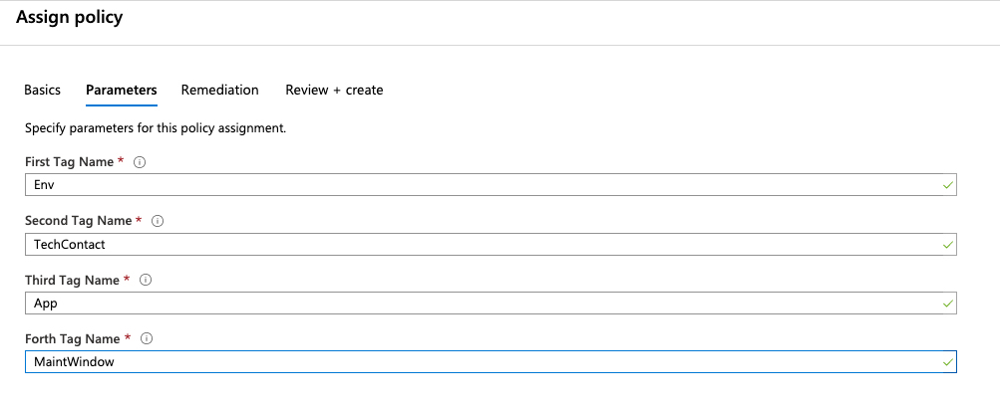

After we let that policy process we can see we have a lot of work on our hands.  While it is not the result that we had hoped for it, it does provide guidance on our next steps.

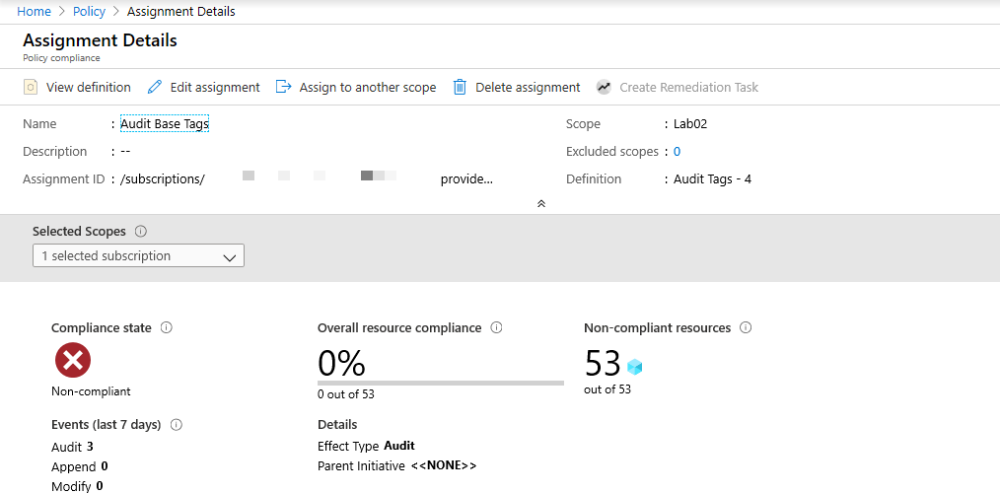

### Step 2 - Create a policy to prohibit resources from being created without the Env, Owner, and App tags defined.  

Now that we policy in place to audit our existing resources, we need to ensure all new resources will have the correct tags applied.  To do this we are going to create a new policy that is very similar to the audit policy, except we are going to change the effect to "deny" this time.  We are also going to remove the "tagName4" parameter.  In our example in step 1, this was used for the "MaintWindow" tag.  

With the "deny" effect in place, this will prevent new resources from being created.  One thing to keep in mind is that it will also prevent us from modifying existing resources that are out of compliance.  Before the deny policy is assigned, you need to ensure that you have communicated with the appropriate stakeholders so they are aware of this change. 
 
Since we are only making small changes to existing audit policy definition, there is no need to re-write the entire policy definition.  We can duplicate the existing definition and then modify it to meet our needs.  

1. We locate the existing policy definition that we used in the first step.  Along the top, you can see "Duplicate Definition".  

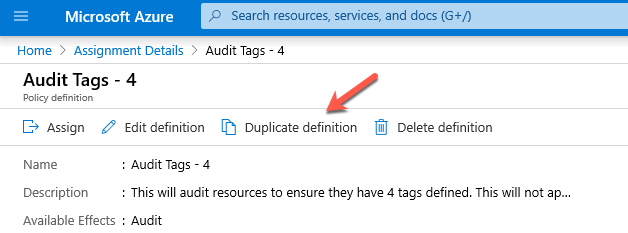

2. This opens a new definition that has the same information as the original definition.  We will need to apply it to the correct location.   Since we are going to have it apply to the same resources we can select the same subscription from the list.

3. We are going to update the policy name to be "Deny resources without required tags". 

3. Scrolling down to the "Policy Rule" section, we can see the actual policy definition.  We are going to update the effect to be "deny" as shown below. 

```json
},
"then": {
 "effect": "deny"
}
```

4. We are also going to remove the "tagName4" from the parameters as well as if block in the policy rule.  Putting this all together it looks like this below. 

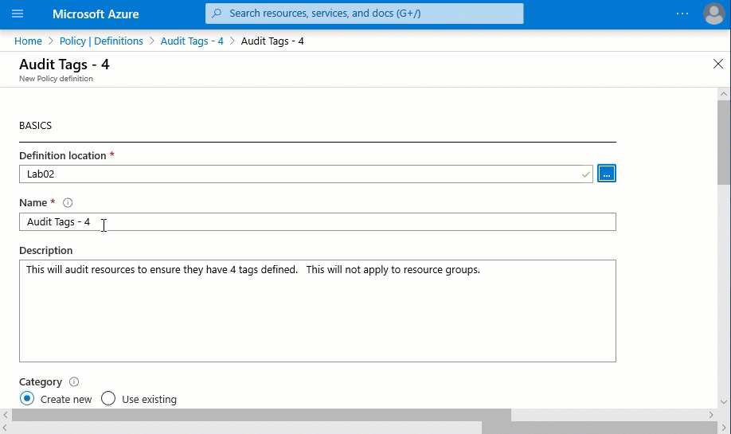

5. Now we have a policy definition with the "deny" effect and updated parameters.  We will assign it the same way we did for the first step.  This time we only define "Env", "TechContact", and "App" in the parameters. 

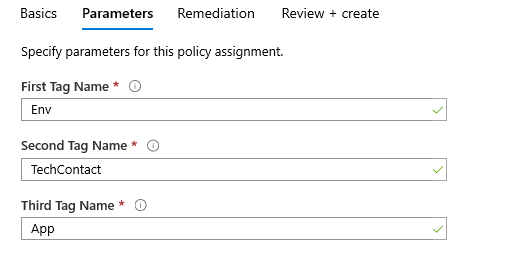

### Step 3 - Applying tags from a resource group

Now we have a policy to audit our resources to ensure they are tagged properly.  We have another policy to ensure no new resources are created without the required tags.  We can now focus on the existing resources that are improperly tagged.  One way that we can use Azure policy to populate resource tags is to have them inherit tags from their parent resource group.  While this solution may not work every time, it is an option to keep in mind.  

Since this should be deployed on a case by case basis, we are going to set the scope to the resource group "Acct-rg".  Before we deploy this policy, let's look at the existing tags applied to the resources.  On resource group we can see the "App" and "Env" tags are set correctly.  Of the existing resources, only the "Acct-vnet" has any tags assigned.  Unfortunately, the tags currently assigned to that vnet are don't provide any real value.  

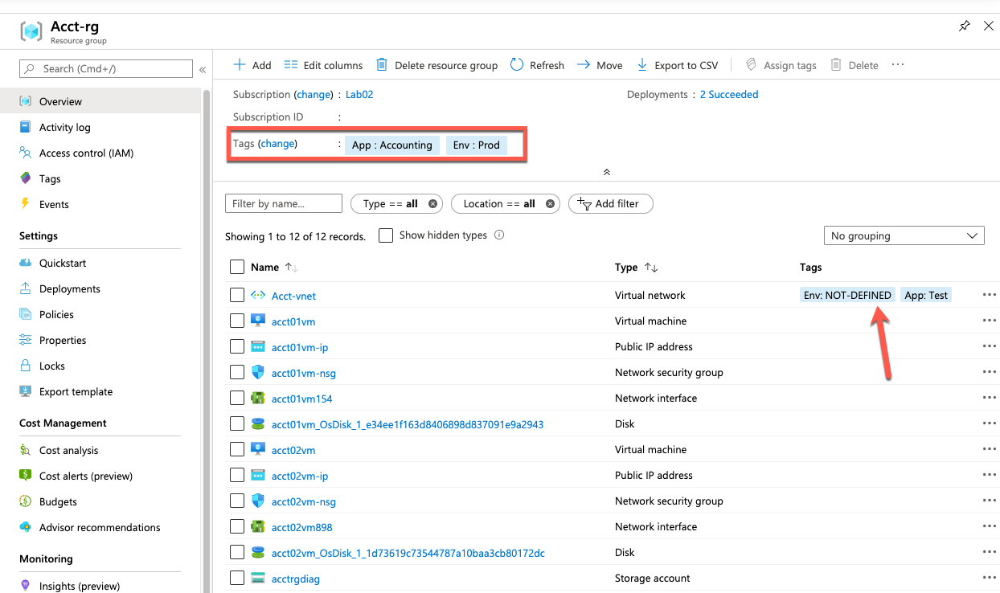

Microsoft has already created a policy definition for us that will inherit a tag from the resource group.  It is called "Inherit a tag from the resource group if it is missing".  This will apply a tag if it is not present.  However, if that tag already exists it will not overwrite it. In our example, this means that existing tags on the "Acct-vnet" should not be modified. 

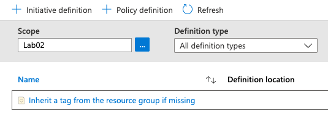

We are going to assign this policy specifically the the "Acct-rg" by defining the scope.  In previous examples, we have set the scope to the subscription.  In this example, we are going to set it to a specific resource group.  

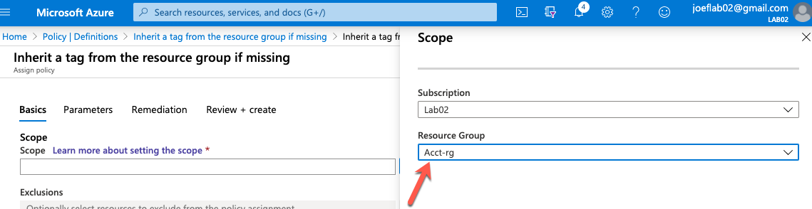

We need to update the assignment name to reflect which tag we are having the clients inherit.  In this case we are going to use inheritance to apply the "App" tag.  We set the name to "Inherit the App tag from the Acct-rg resource group". 

In the parameters specify "App" as the tag name. 

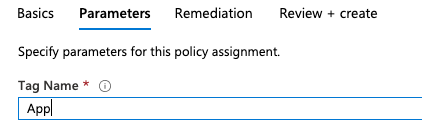

One thing we have not covered is Remediation steps.  Since we are asking Azure Policy to make changes to existing resources, we need some mechanism to make these changes.  By selecting "Create a remediation task" it will create a background process that updates the resources as defined in the policy.  In this case, we are assigning tags to the resources based on the values defined at the resource group level.  

We are going to check the box to "Create a remediation task".  You may also notice it will create a managed identity and ask you for a location.  The location we select will not have any impact on the functionality of the remediation task.  It is an option so you can keep the managed identity in the same region as your other resources.  I'm going to leave the default of "East Us". 

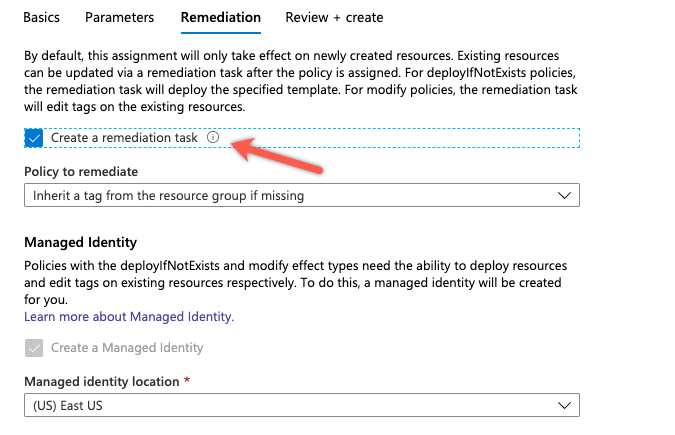

We will create this assignment and then repeat the same steps for the "Env" tag.  We will be naming that assignment "Inherit the Env tag from the Acct-rg resource group". 

After a while, we can review the Acct-rg and see that all of the resources have inherited the values of the App and Env tags from the resource group.  As expected, we notice that the tag values for "Acct-vnet" have not changed.  

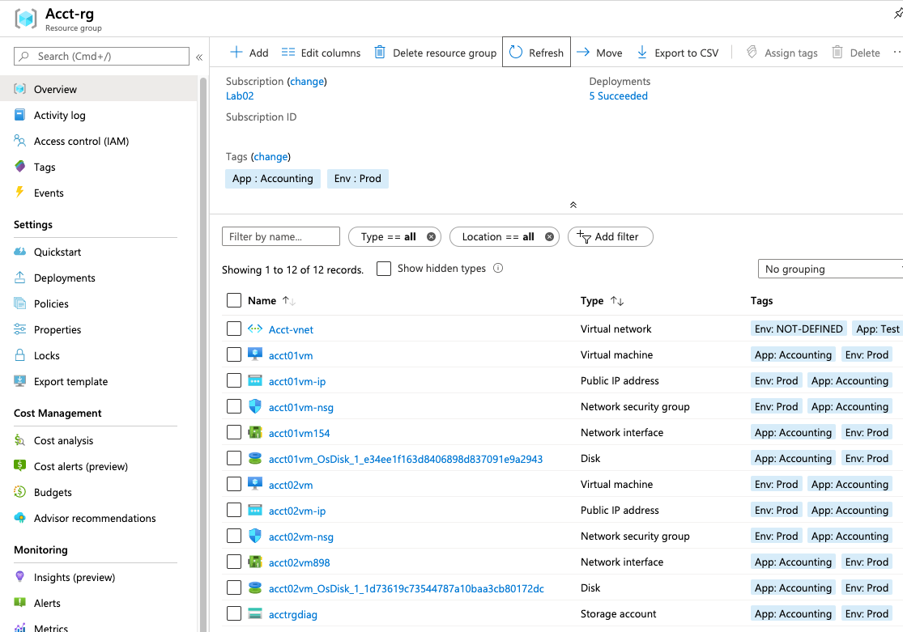

Hopefully, this has helped explain a few ways that you can manage tags in Azure.  Check back soon for a follow-up post where we show some more examples of ways we can leverage Azure Policy to manage resource tags.  