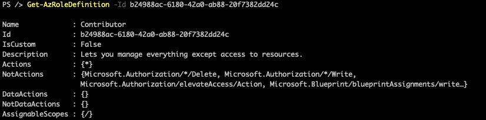
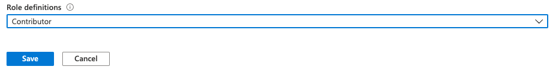
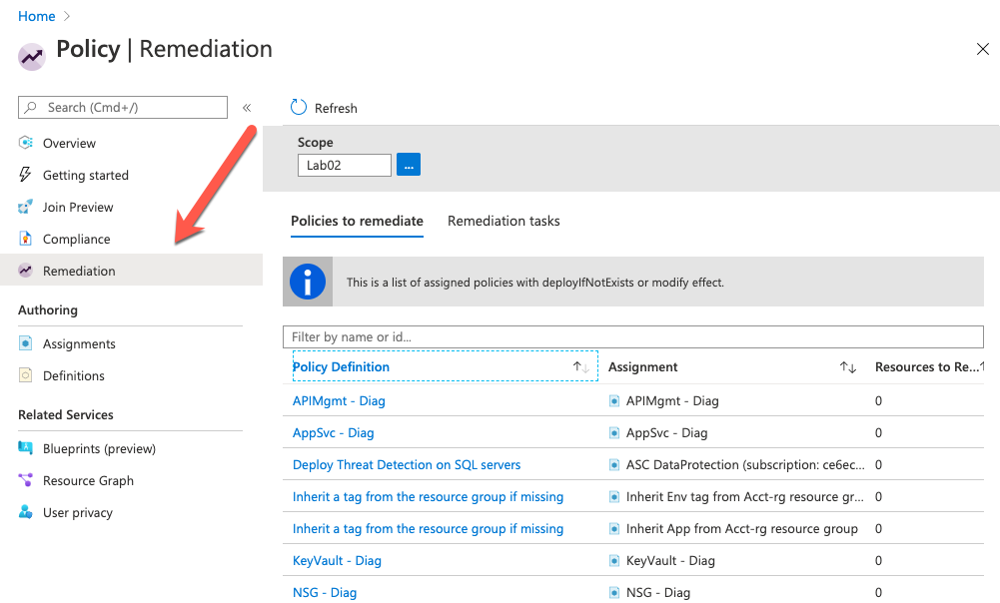
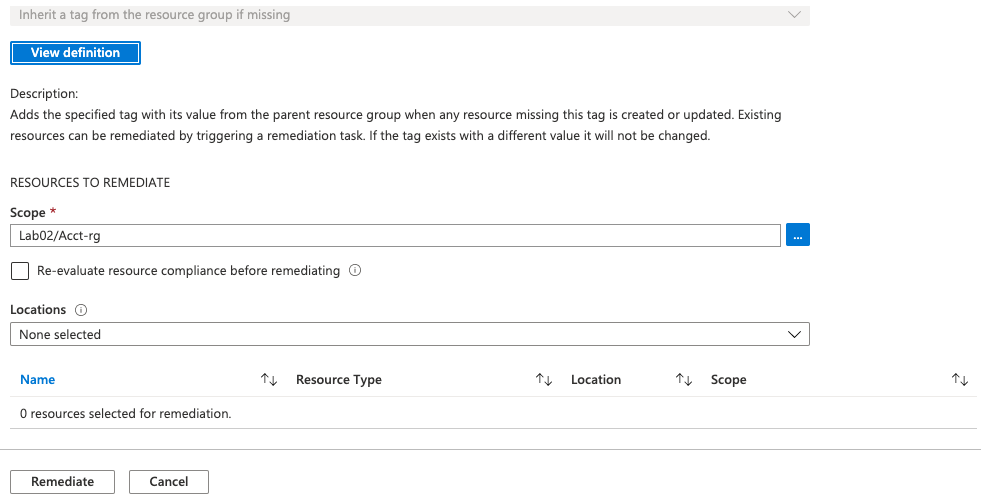
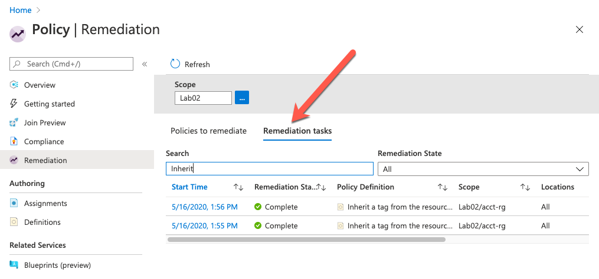
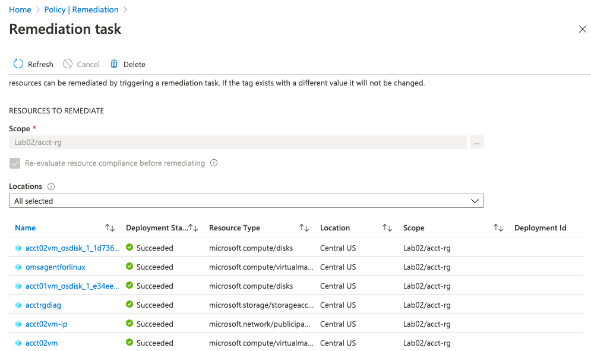
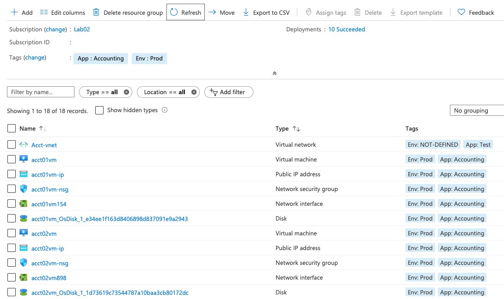
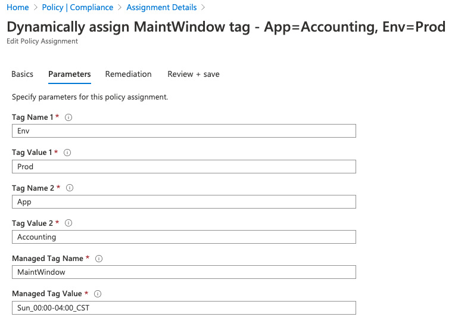
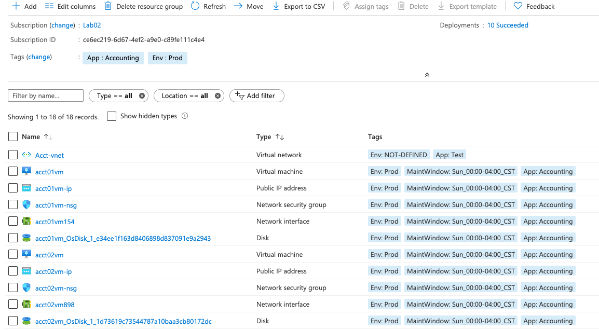

# Managing Azure Resource Tagging with Azure Policy - Part 2

### Goals

This is a follow-up post to [Managing Resource Tagging with Azure Policy](https://cloudskills.io/blog/azure-policy-tagging). In this post, we are going to take a closer look at how the "Modify" effect works and understand how to manage the associated remediation tasks.  We will also set up a policy that will allow us to dynamically assign a tag value. 

### Understanding the "Modify" Effect

In our [previous post](https://cloudskills.io/blog/azure-policy-tagging), we set up a policy to take a tag name and value that was set at a resource group, and have all the resources within that group inherit those values. It would only apply to the child resources if that resource did not already have the same tag name in place.   We validated it worked correctly but did not take a closer look at it worked. 

This is the policy definition from the built-in policy "Inherit a tag from the resource group if missing"

```json
"policyRule": {
    "if": {
        "allOf": [
            {
                "field": "[concat('tags[', parameters('tagName'), ']')]",
                "exists": "false"
            },
            {
                "value": "[resourceGroup().tags[parameters('tagName')]]",
                "notEquals": ""
            }
        ]
    },
    "then": {
        "effect": "modify",
    },
        "details": {
            "roleDefinitionIds": [
                "/providers/microsoft.authorization/roleDefinitions/b24988ac-6180-42a0-ab88-20f7382dd24c"
            ],
        "operations": [
                {
                    "operation": "add",
                    "field": "[concat('tags[', parameters('tagName'), ']')]",
                    "value": "[resourceGroup().tags[parameters('tagName')]]"
                }
        ]
    }
}
```

Starting at the "If" block we can see that it has two conditions it is checking.  The first is to see if the tag we assign to the parameter "tagName" is present on the resource.  The second is confirming that the tag doesn't have a null value on the resource group.  

We can also see it is using the "allOf" operator.  This means that both of the conditions must be met in order to apply the effect.  

Moving to the effect we can see it is set to "modify".  This effect is only used for managing tags. If we're trying to manage any other aspect of the resource, we would use the "deployIfNotExists" effect.  We can also see a new section after the effect called "details".

```json
"details": {
    "roleDefinitionIds": [
        "/providers/microsoft.authorization/roleDefinitions/b24988ac-6180-42a0-ab88-20f7382dd24c"
    ],
    "operations": [
        {
            "operation": "add",
            "field": "[concat('tags[', parameters('tagName'), ']')]",
            "value": "[resourceGroup().tags[parameters('tagName')]]"
        }
    ]
}
```

Taking a closer look at the "details" block, the first section is "roleDefinitionIds".  If you remember when we created the policy assignment in the previous post, we talked about the managed identity that is created as part of the policy assignment.  In order for Azure to perform actions on the appropriate resource type, the managed identity needs to be assigned one or more RBAC roles.  The RBAC role is assigned to the managed identity using its role definition ID.  You can determine which RBAC role is being used looking up the ID as shown below.   



We can also see which roles are assigned to a policy definition by looking at the bottom of the editing screen. 



If we look at the majority of the Microsoft templates you can see that they use the "Contributor" role as shown above.  You can find a list of all of the built in RBAC roles and their associated ID [here](https://docs.microsoft.com/en-us/azure/role-based-access-control/built-in-roles). 

Moving down to the Operations block we can see that it is using the "add" operation to set the tag name and tag value.  The format is consistent across various "Modify" operations as it used for exclusively managing tags. 

We can also use the "addOrReplace" operation as we can see in the example below.  The difference is this operation will overwrite the tag value if it is set to something different.  

```json
"operations": [
    {
        "operation": "addOrReplace",
        "field": "[concat('tags[', parameters('tagName'), ']')]",
        "value": "[parameters('tagValue')]"
    }
]
```

### Remediation Tasks

Now that we understand the Modify effect, let's take a look at Remediation tasks.  Any time a policy will be altering resources a remediation task is created to facilitate that change. 
 
We can find Remediation tasks from the Policy page and selecting "Remediation" on the left.  This is where we can see a list of policies that have remediation tasks and also view their history.  



We can see towards the bottom our two remediation tasks we set up in our last post. These are the tasks that applied the tags from the "Acct-RG" resource group to the resources within that group.  If we click on either of these tasks, we can see there are no resources out of compliance with this policy.  If there were any, we could click on them and select "Remediate".   This would tell the remediation task to run against those resources, which applies the "Add" operation we discussed above.



From the Remediation page, we can select "Remediation Tasks" on the top.  This allows us to see the history of these tasks and if they have completed successfully.  



In the search bar, we've entered "Inherit" to filter down the results to show those related to our tag inheritance policies.   We can see that both completed successfully.  If any had failed you would also see this under the Remediation State.  Additionally, we can filter by the remediation state if needed.
 
We can select either of the tasks and see the individual resources that the remediation task has modified.



If any had failed we would have an link on under the "Deployment Id" column for that resource.  This would help explain what had caused the task to fail. 


### Dynamically Assigned Tags

The whole point of Azure Policy is to make life easier for ourselves.  We now understand what is happening under the sheets with the "modify" effect.  Let's see how we can use it to dynamically assign a value to our resources based on the values of other tags.  

Our goal is to define the "MaintWindow" tag on all resources associated with the production Accounting application.  To do this we are going to create a policy that will look at all resources in our subscription that have the tags "App"="Accounting" and "Env"="Prod".  We want to set the "MaintWindow" tag to have a value of "Sun_00:00-04:00_CDT" on those resources. 

Our policy definition that we will use to complete this is shown below.  Notice the general parameter names in the definition.  This helps keep the definition flexible for future assignments.  The sample below can be downloaded [here](https://github.com/jf781/Azure.Policy.Demos/blob/master/Dynamically-Assign-Resource_Tags.json).  

```json
{
    "mode": "Indexed",
    "policyRule": {
        "if": {
            "allOf": [
                {
                    "field": "[concat('tags[', parameters('tagName1'), ']')]",
                    "Equals": "[parameters('tagValue1')]"
                },
                {
                    "field": "[concat('tags[', parameters('tagName2'), ']')]",
                    "Equals": "[parameters('tagValue2')]"
                },
                {
                    "field": "[concat('tags[', parameters('managedTagName'), ']')]",
                    "notEquals": "[parameters('managedTagValue')]"
                }
            ]
        },
        "then": {
            "effect": "modify",
            "details": {
                "roleDefinitionIds": [
                        "/providers/microsoft.authorization/roleDefinitions/b24988ac-6180-42a0-ab88-20f7382dd24c"
                ],
                "operations": [
                    {
                        "operation": "addOrReplace",
                        "field": "[concat('tags[', parameters('managedTagName'), ']')]",
                        "value": "[parameters('managedTagValue')]"
                    }
                ]
            }
        }
    },
    "parameters": {
        "tagName1": {
            "type": "String",
            "metadata": {
                "displayName": "Tag Name 1",
                "description": "Name of a tag, such as 'Env'"
            }
        },
        "tagValue1": {
            "type": "String",
            "metadata": {
                "displayName": "Tag Value 1",
                "description": "Value of 'Tag Name 1', such as 'development'"
            }
        },
        "tagName2": {
            "type": "String",
            "metadata": {
                "displayName": "Tag Name 2",
                "description": "Name of a tag, such as 'App'"
            }
        },
        "tagValue2": {
            "type": "String",
            "metadata": {
                "displayName": "Tag Value 2",
                "description": "Value of 'Tag Name 2', such as 'App01'"
            }
        },
        "managedTagName": {
            "type": "String",
            "metadata": {
                "displayName": "Managed Tag Name",
                "description": "Name of the tag value to populate, such as 'MaintWindow'"
            }
        },
        "managedTagValue": {
            "type": "String",
            "metadata": {
                "displayName": "Managed Tag Value",
                "description": "Value of the tag, such as 'Fri_21:00-23:00_CDT'"
            }
        }
    }
}
```

There are a few more parameters here then we have used in the past but the core concepts are the same.
  
Looking at the first part of the if statement, we are checking if the resource has the tag name and values associated with the parameters.

```json
{
 "mode": "Indexed",
 "policyRule": {
    "if": {
        "allOf": [
            {
                "field": "[concat('tags[', parameters('tagName1'), ']')]",
                "Equals": "[parameters('tagValue1')]"
            },
            {
                "field": "[concat('tags[', parameters('tagName2'), ']')]",
                "Equals": "[parameters('tagValue2')]"
            },
```

In the second part of the if statement we are checking to see if the managed tag name and its value do not match the defined value in the parameter (note the "notEquals" in this statement verse the two above).  If it does match then the resource is compliant.  If it doesn't exist or has a different value then the resource is out of compliance and the remediation task will apply.  

```json
                    "field": "[concat('tags[', parameters('managedTagName'), ']')]",
                    "notEquals": "[parameters('managedTagValue')]"
                }
            ]
        },
```

The modify effect is using the "addOrReplace" operation.  This will add the tag name and value if it is not present or overwrite if the tag is present but the value is different.  

Let's look at the resources we created in our last post.  We can see all of the resources have the "App" and the "Env" defined.   Most of them have their values set to "Accounting" and "Prod", respectively.  The exception again is the "Acct-Vnet" resource.   



We've created a policy assignment named "Dynamically assign MaintWindow tag - App=Accounting, Env=Prod".  At first glance, this might be slightly verbose.  However, we intended to use the policy definition above multiple times.  By naming each assignment this way it helps us easily identify what this specific assignment is doing.  

Looking at the parameters for the assignment we can see that it is looking at the "Env" and "App" tags.  Specifically, if the "Env" tag is set to "Prod" and the "App" tag is set to "Accounting".  We can also see we are have set the "Managed Tag Name" to "MaintWindow" and "Managed Tag Value" to "Sun_00:00-04:00_CDT".  



Now that we have our policy definition created and it's been assigned, will wait for a bit to allow it to run.    



Perfect!!  Exactly as we intended.  All resources that had the tags "App"="Accounting" and "Env"="Prod" were updated.  We can also see that the Acct-vnet was not modified since it's tag values did not match the policy.  

This can be a very powerful way to assign tags.  If we need to increase the number of tags were using to as a baseline, we can simply add another "tagName#" and "tagValue#" parameters, update the if statement and the rest will work the same.   

Hopefully this helped you think of some new ways that you can manage your resource tags in Azure.  Please check back soon, our next post will cover how to configure resource diagnostic settings with Azure Policy. 

